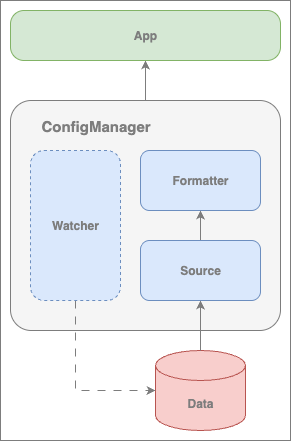

# Confgo

## Install

**TODO**

## What is Confgo

Confgo is a simple yet powerful tool for configuring Go applications. It's designed to allow users to easily manage
their applications by simply defining their own configuration structures. Confgo handles all the infrastructure logic
for reading, loading, monitoring, and updating itself. Currently, Confgo supports:

- file reading
- parsing data in JSON and YAML formats
- reading environment variables
- tracking configuration changes

As you can see in the figure below, Confgo consists of three main components:



- `Source` is responsible for reading data from the source, which can be any source.
- `Formatter` is responsible for serializing the received data. Together with `Source`, these components form the core
  of Confgo. Their various combinations allow for flexible configuration of reading and parsing configurations.
- `Watcher` is responsible for monitoring data updates. Implementations can be based on various strategies, ranging from
  simple data comparison by value to comparison of the last data modification time. `Watcher` is an optional component,
  allowing for customization of both static and dynamic configurations.

## Getting started

> [!TIP]
> For more examples, check out the [examples](./examples).

Below is a simple example of how to use Confgo. Here we handle static json file, meaning after calling `cm.MustStart()`
any futher updates in `config.json` will not have effect on `cm.Config()`, it will be returning the same initial config
anyway.

```go
type Config struct {
	Host string `json:"host"`
	Port int    `json:"port"`
}

func main() {
	cm, err := confgo.NewConfigManagerFor[Config](confgo.WithJSONFile("examples/static/config.json"))
	if err != nil {
		panic(err)
	}
	cm.MustStart()
	defer cm.MustStop()

	fmt.Printf("%#v\n", cm.Config())
	// &main.Config{Host:"localhost", Port:1234}
}
```

To handle dynamic configuration, use special option:

```go
type Config struct {
	Host string `json:"host"`
	Port int    `json:"port"`
}

func main() {
	cm, err := confgo.NewConfigManagerFor[Config](confgo.WithDynamicJSONFile("config.json",
		func() {
			fmt.Printf("Config has been updated!\n")
		},
		func(err error) {
			fmt.Printf("Error while updating config: %v\n", err)
		}))
	if err != nil {
		panic(err)
	}
	cm.MustStart()
	defer cm.MustStop()

	for {
		fmt.Printf("%#v\n", cm.Config())
		time.Sleep(3 * time.Second)
		// Here we update config file
	}
}
```
